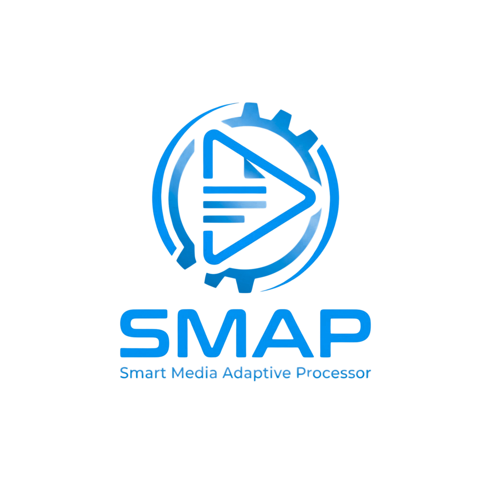

# SMAP-Project

Markdown
# SMAP (Smart Media Adaptive Processor)



SMAP adalah aplikasi desktop yang dirancang untuk memproses dan mengompresi media (Video/Gambar) secara efisien dengan kontrol penuh terhadap parameter output. Proyek ini menggabungkan antarmuka modern berbasis Qt (PySide6) dengan mesin pemrosesan media berbasis FFmpeg.

## 🚀 Fitur Utama
- **Video Compression:** Konversi dan kompresi video berbasis FFmpeg dengan opsi parameter yang fleksibel.
- **Dynamic UI:** Antarmuka responsif dengan kemampuan *drag-and-drop* dan navigasi file manual.
- **Custom Output Control:** User memiliki kontrol penuh dalam menentukan direktori penyimpanan hasil pemrosesan.
- **Modern Workflow:** Arsitektur modular yang memisahkan logika `core` dan `gui`.

## 🛠️ Tech Stack
- **Language:** Python 3.10+
- **GUI Framework:** PySide6
- **Media Processing:** FFmpeg
- **Architecture:** Threaded Processing (untuk mencegah GUI *freeze*)

## 📦 Instalasi & Setup

1. **Clone repository:**
   ```bash
   git clone [https://github.com/gusti111/SMAP-Project.git](https://github.com/gusti111/SMAP-Project.git)
   cd SMAP-Project
   
2. Setup Environment (Opsional):
   ```Bash
   python -m venv venv
   source venv/bin/activate  # Windows: venv\Scripts\activate

3. Install Dependencies:
   ```Bash
   pip install -r requirements.txt


4. Konfigurasi FFmpeg:
   Karena file biner FFmpeg tidak di-upload ke repository, silakan:
  
   Unduh FFmpeg dari ffmpeg.org.
  
   Tempatkan ffmpeg.exe dan ffprobe.exe di dalam folder bin/ pada direktori root proyek ini.

5. Jalankan Aplikasi:
   ```Bash
   python main.py

📂 Struktur Folder
   ```Plaintext
     SMAP-Project/
      ├── assets/         # Logo dan aset visual
      ├── bin/            # Letakkan ffmpeg.exe dan ffprobe.exe di sini
      ├── core/           # Logika pemrosesan media (VideoEngine)
      ├── gui/            # File antarmuka PySide6
      ├── main.py         # Entry point aplikasi
      └── requirements.txt

📝 Kontribusi
Proyek ini dikembangkan secara terbuka. Jika kamu menemukan bug atau memiliki ide untuk optimasi engine, silakan buka issue atau kirim pull request.

Dibuat oleh Gusti Faqikh


### Tips Implementasi:
1. **Asset Gambar:** Pastikan file logo kamu benar-benar berada di `assets/logo.png` agar gambar muncul di GitHub. Jika lokasinya berbeda, sesuaikan link pada bagian ``.
2. **FFmpeg:** Penjelasan di bagian Instalasi sangat krusial. Jika user tidak menaruh `ffmpeg.exe` di folder `bin/`, aplikasi akan *crash* saat mencoba memproses video. Ini adalah "kontrak" antara kamu dan user.
3. **Penyimpanan:** Setelah kamu simpan file ini di GitHub, periksa tampilannya. Jika sudah muncul dengan baik, itu menandakan dokumentasi kamu sudah level profesional.

Apakah ada detail fitur lain yang ingin kamu tambahkan, atau instruksi instalasi ini sudah mencakup kebutuhan user yang akan memakai kodemu?
